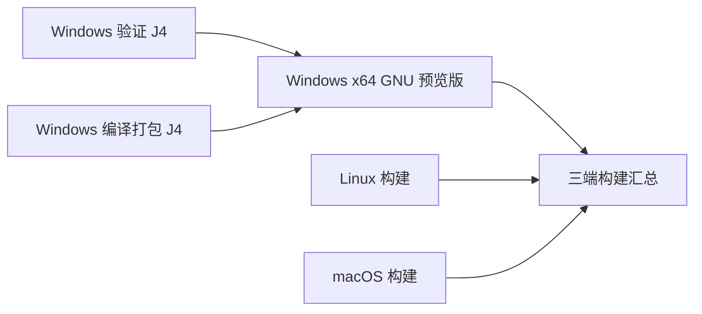

# Windows CI 并行验证与编译

Windows 预览 CI 将验证与产物编译分成两个独立的 `windows-2022` 作业。每个作业分配自己的 GitHub 托管 runner、CPU、内存和临时目录，各自使用 `-j4`；两个作业之间没有 `needs` 依赖。

- `windows-gnu-validation` 保留 Windows PowerShell 5.1 / PowerShell 7 安装器测试、包协议、发布策略、发布说明、本地化检查及全部 12 条 Cargo 测试命令。
- `windows-gnu-build` 保留预览编译参数、资源监控、包内协议与文件清单、打包和制品上传。编译与验证使用相同的 CI 版本号和工具链。
- 原来的 `windows-gnu-preview` ID 和“Windows x64 GNU 预览版”名称作为聚合检查保留。它在两个作业结束后执行；任一结果为失败、取消或跳过时，该检查失败。三端汇总继续依赖它。
- 编译制品可能先于验证作业完成上传；完整验收以 Windows 聚合检查和三端汇总结果为准。

## 共用准备与隔离边界

两个 Windows 作业调用 `.github/actions/setup-windows-gnu`，统一选择版本、准备固定 Rust / MinGW / protoc、恢复 Cargo registry/git，并各自在自己的 runner 获取依赖，以满足后续 `--frozen` 调用。

验证作业只读取依赖缓存，不恢复或写入 release 编译缓存。编译作业保留已有的 target / host release 缓存及保存条件，避免两个作业同时保存同一依赖缓存键。本次不改变测试 feature、编译 profile、增量开关或正式 Release 工作流。

两个作业的 `-j4` 不竞争同一台 runner 的 CPU。将编译降到 `-j2` 不会给独立的验证 runner 增加资源；应先根据两组实际耗时评估，并计入 Linux、macOS、准备和排队时间。并行缩短的是等待时间，并不等于减少总计算量。

手动触发工作流时，可启用 `parallel_run`，让本轮使用包含运行 ID 的独立并发组，保留同分支仍在执行的其他 CI。该开关默认关闭，日常推送和普通手动触发继续沿用原来的同分支取消规则。不同运行的制品带各自运行 ID，验收时仍需核对对应提交。

## 串行基线

基线为 [CI 34709545996](https://github.com/JoyElliot/grok-build-Chinese/actions/runs/34709545996)，提交 `e84eb5af2ed8410458f205d0cecff4ad4d63a1d5`。该轮三端构建和汇总全部成功。

| Windows 阶段 | 耗时 |
| --- | --- |
| 本地化验证及测试编译 | 43 分 45 秒 |
| 产物编译及资源监控 | 33 分 17 秒 |
| 整个 Windows 作业 | 81 分 44 秒 |

并行收益须以新 CI 中两个 Windows 作业的开始/结束时间、同阶段日志和最终汇总时间验证；两个作业各自进行准备和依赖恢复，不能直接把基线的两个阶段相减当作实际收益。
